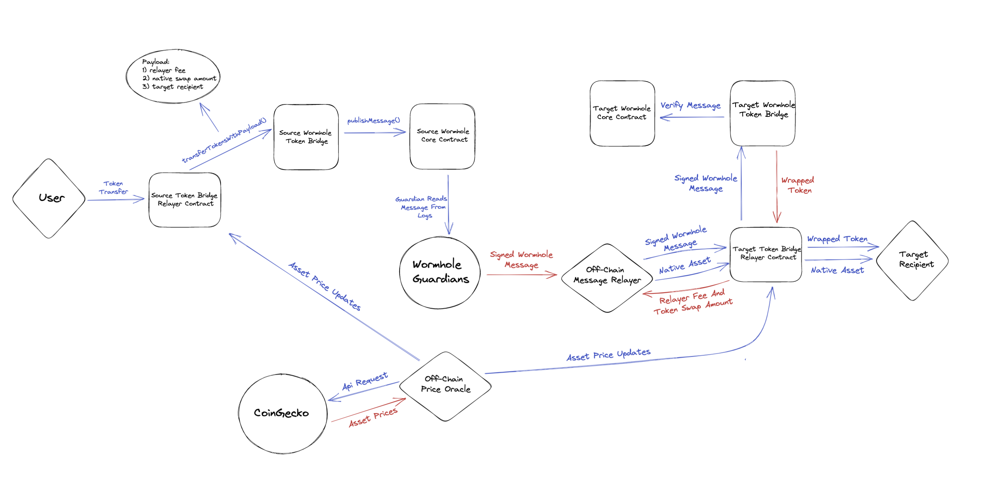

# Example-Token-Bridge-Relayer

## Wormhole-Scaffolding

This repository was generated from the [wormhole-scaffolding](https://github.com/wormhole-foundation/wormhole-scaffolding) template. We recommend using this template as a starting point for cross-chain development on Wormhole.

## Prerequisites

### EVM

Install [Foundry tools](https://book.getfoundry.sh/getting-started/installation), which include `forge`, `anvil` and `cast` CLI tools.

## Build, Test and Deploy Smart Contracts

Each directory represents Wormhole integrations for specific blockchain networks. Please navigate to a network subdirectory to see more details (see the relevant README.md) on building, testing and deploying the smart contracts.

## Off-Chain Relayers

See the relayer [README.md](./relayer/README.md) file.

<<<<<<< HEAD
## Design
=======
## System Design
>>>>>>> 3da00cc (add design diagram)

